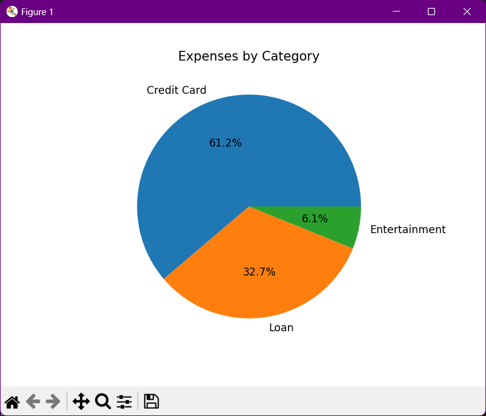

# Personal Finance Tracker

This is a simple personal finance tracker built with Python. It allows you to add, view, save, and load transactions, and visualize expenses using pie charts.

## Features

- **Income and Expense Tracking**:
  - Add, edit, and delete income and expenses.
  - Categorize transactions (e.g., salary, groceries, entertainment).

- **Monthly Summary**:
  - Display a summary of income and expenses for a given month.
  - Calculate savings for the month.

- **Data Visualization**:
  - Plot monthly income vs expenses.
  - Create pie charts for expense categories.

- **Saving and Loading Data**:
  - Save data to a file (CSV or JSON).
  - Load data from a file on startup.

## Project Structure

- `transaction.py`: Defines the data models (`Transaction` and `FinanceTracker`) and handles data management.
- `main.py`: Provides a command-line interface for user interaction.
- `visualization.py`: Contains functions for data visualization using `matplotlib`.

## Installation

1. **Clone the repository**:

   ```bash
   git clone https://github.com/<username>/personal_finance_tracker.git
   cd personal_finance_tracker
   
2. **Create a virtual environment**
   ```bash
   python3 -m venv venv
   source venv/bin/activate  # On Windows, use `venv\Scripts\activate`

4. **Install dependencies**
   ```bash
   pip install matplotlib

## Demo

